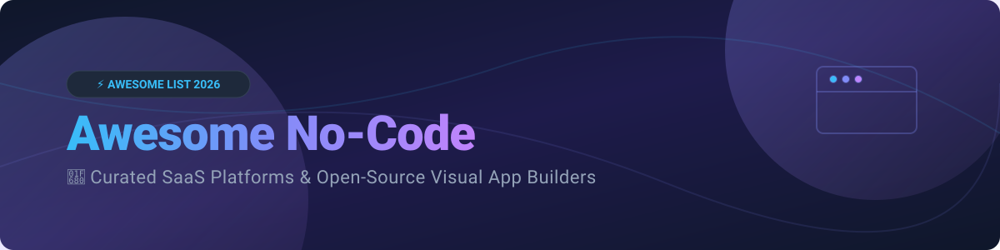

# Awesome No-Code ⚡

  

  
  
  
  
  
  

---

## 🚀 Overview & Ecosystem Snapshot

Welcome to **Awesome No-Code**, the ultimate curated collection of **No-Code & Low-Code development platforms**, visual app builders, website creators, internal tool engines, and open-source software building blocks.

Whether you are a founder launching a SaaS MVP, an enterprise engineer automating workflows, or a product team creating internal admin dashboards, this guide covers commercial leaders and self-hosted open-source alternatives.

---

## 📌 Table of Contents

- [📊 SaaS & Hosted No-Code Platforms](#-saas--hosted-no-code-platforms)
- [🔓 Open-Source GitHub Projects](#-open-source-github-projects)
- [🧩 Composable No-Code Architectures](#-composable-no-code-architectures)
- [🤝 How to Contribute](#-how-to-contribute)
- [💖 Support & Sponsorship](#-support--sponsorship)
- [⚠️ Disclaimer](#-disclaimer)
- [📈 Star History](#-star-history)

---

## 📊 SaaS & Hosted No-Code Platforms

> 💡 **Market Size & Structure Insights**: The global No-Code & Low-Code platform market is estimated at **$30+ Billion in 2026** (projected to surpass $65 Billion by 2030 at a 22%+ CAGR). The sector is **moderately fragmented**—rather than a single "winner-take-all" vendor, specialized market leaders dominate distinct categories like visual web design (Webflow), complex full-stack web applications (Bubble), mobile apps (Glide/Adalo), and business landing pages (Carrd/Softr).

| 🛠️ Product | 📝 Description | 💰 Valuation / Revenue / Size | 💳 Pricing (Paid Tiers) | 🎁 Free Tier / Trial Limits |
| :--- | :--- | :--- | :--- | :--- |
| **[Webflow](https://webflow.com/)** | Design-focused visual website builder and CMS for responsive marketing sites, blogs, and visual web development without code. | **~$4.0 Billion Valuation** ($100M+ ARR) | Starting at **$14/mo** (Basic, billed annually) or $18/mo monthly | **Free Forever**: 2 static pages, 50 CMS items, webflow.io subdomain, 1k visitors/mo |
| **[Bubble](https://bubble.io/)** | Full-stack visual app builder with database, workflow editor, plugin ecosystem, and user auth for web apps and SaaS products. | **~$480 Million Valuation** ($25M+ ARR) | Starting at **$29/mo** (Starter, billed annually) or $32/mo monthly | **Free Forever**: 50,000 workload units/mo, bubbleapps.io subdomain, dev mode |
| **[Glide](https://www.glideapps.com/)** | Fast visual builder turning spreadsheets (Google Sheets, Airtable, Excel) into responsive web and mobile apps. | **~$200 Million Valuation** ($10M+ ARR) | Starting at **$25/mo** (Maker Plan) or $49/mo (Team Plan) | **Free Forever**: Up to 10 personal users, 500 data rows, glide.page subdomain |
| **[Softr](https://www.softr.io/)** | Web app builder converting Airtable or Google Sheets into client portals, internal tools, and membership directories. | **~$50 Million Valuation** ($5M+ ARR) | Starting at **$49/mo** (Basic, billed annually) or $59/mo monthly | **Free Forever**: 1 custom domain, 5 internal users, 1,000 records, softr.app subdomain |
| **[Thunkable](https://thunkable.com/)** | Drag-and-drop mobile app builder to create native iOS and Android applications with complete mobile API integrations. | **~$30 Million Valuation** ($3M+ ARR) | Starting at **$13/mo** (Starter, billed annually) or $15/mo monthly | **Free Forever**: Public projects, 200MB asset storage, 10 app downloads/mo |
| **[Adalo](https://www.adalo.com/)** | Visual no-code mobile and web app builder with built-in database, native app store publishing, and custom API actions. | **~$25 Million Valuation** ($2M+ ARR) | Starting at **$36/mo** (Starter, billed annually) or $45/mo monthly | **Free Forever**: Unlimited test apps, 200 data records/app, adalo.com subdomain |
| **[Carrd](https://carrd.co/)** | Ultra-lightweight visual builder for simple, responsive single-page websites, landing pages, and personal profiles. | **~$15 Million Valuation** ($2M+ ARR) | Starting at **$9/year** (~$0.75/mo, Pro Lite Plan) | **Free Forever**: Up to 3 sites per account, carrd.co subdomain, core blocks |
| **[Noloco](https://noloco.io/)** | No-code app builder for creating custom internal tools, client portals, and CRM dashboards on top of Airtable, Postgres, and SQL. | **~$10 Million Valuation** ($1M+ ARR) | Starting at **$39/mo** (Starter, billed annually) or $49/mo monthly | **30-Day Free Trial**: Full Pro plan access, 1,000 data rows, 5 app users during trial |
| **[Dorik](https://dorik.com/)** | Visual website and CMS builder with AI site generator, white-label features, and client billing integration. | **~$5 Million Valuation** ($1M+ ARR) | Starting at **$15/mo** (Personal, billed annually) or $19/mo monthly | **Free Forever**: Up to 5 pages, dorik.io subdomain, static site features & contact forms |
| **[Bravo Studio](https://www.bravostudio.app/)** | No-code mobile builder turning Figma and Adobe XD designs into native iOS & Android apps via REST APIs. | **~$4 Million Valuation** ($500k+ ARR) | Starting at **€19/mo** (~$21/mo Solo Plan) | **Free Forever**: 1 app project, 15 app screens, watermarked test builds |

---

## 🔓 Open-Source GitHub Projects

The open-source low-code / no-code ecosystem empowers organizations to deploy self-hosted visual builders, eliminate vendor lock-in, and maintain 100% data governance.

*(Sorted descending by GitHub Stars_Count ⭐)*

1. **[n8n](https://github.com/n8n-io/n8n)**   
   Fair-code workflow automation and node-based low-code integration builder connecting 400+ services with native AI node support.
2. **[Supabase](https://github.com/supabase/supabase)**   
   Open-source Firebase alternative providing auto-generated REST & GraphQL APIs, Postgres database, auth, vector storage, and edge functions.
3. **[AppFlowy](https://github.com/AppFlowy-IO/AppFlowy)**   
   Open-source Notion alternative built with Flutter & Rust for privacy-first visual workspace management and custom data views.
4. **[NocoDB](https://github.com/nocodb/nocodb)**   
   Open-source Airtable alternative that turns any MySQL, PostgreSQL, SQL Server, or SQLite database into a smart spreadsheet interface with APIs & webhooks.
5. **[ToolJet](https://github.com/ToolJet/ToolJet)**   
   Open-source low-code platform for building internal tools, admin panels, and workflows with drag-and-drop UI, custom JS/Python logic, and AI copilots.
6. **[Appsmith](https://github.com/appsmithorg/appsmith)**   
   Popular low-code application builder for quick creation of internal admin portals, dashboards, and CRUD apps connecting to databases and APIs.
7. **[Directus](https://github.com/directus/directus)**   
   Open-source headless CMS and data platform that dynamically mirrors any SQL database into a visual no-code app and instant APIs.
8. **[Refine](https://github.com/refinedev/refine)**   
   React-based low-code framework for rapid development of enterprise internal tools, admin panels, B2B portals, and data-heavy web applications.
9. **[Budibase](https://github.com/Budibase/budibase)**   
   Open-source low-code platform for creating internal tools, forms, and business automation workflows with built-in DB and SSO authentication.
10. **[Activepieces](https://github.com/activepieces/activepieces)**   
    Open-source Zapier alternative for no-code business automation, AI agents, and enterprise workflow orchestration.
11. **[Amplication](https://github.com/amplication/amplication)**   
    Open-source developer tool for low-code backend generation, automatically building Node.js / NestJS services, GraphQL & REST APIs, and Prisma ORM logic.
12. **[Formbricks](https://github.com/formbricks/formbricks)**   
    Open-source Qualtrics / Typeform alternative providing no-code micro-surveys, customer feedback widgets, and form builders.
13. **[ILLA Builder](https://github.com/illa-family/illa-builder)**   
    Open-source low-code internal tool builder with real-time multiplayer editing, JS support, and AI agent integration.
14. **[Baserow](https://github.com/baserow/baserow)**   
    Open-source no-code database and Airtable alternative allowing users to create relational databases, web apps, and customer portals without coding.
15. **[Lowdefy](https://github.com/lowdefy/lowdefy)**   
    Open-source config-driven low-code framework to build internal tools, dashboards, and web forms using YAML or JSON.

---

## 🧩 Composable No-Code Architectures

For self-hosted privacy and scalability, combining specialized open-source engines yields a complete modern stack:

- 🗄️ **Data Engine**: **NocoDB** or **Supabase** (Database + Auto API layer)
- 🖥️ **Visual UI**: **Appsmith** or **ToolJet** (Admin frontend + Drag-and-drop dashboard)
- ⚡ **Workflow & Automation**: **n8n** or **Activepieces** (Background event processing & AI integrations)

---

## 🤝 How to Contribute

Contributions are warmly welcomed! Please follow these simple guidelines:

1. Fork this repository.
2. Add your suggested SaaS product or open-source tool to `README.md`.
3. Provide accurate information: exact starting pricing, free tier limits, GitHub Stars_Badges, or company metrics.
4. Submit a Pull Request (PR) with a brief summary of the project.

---

## 💖 Support & Sponsorship

If you find this repository helpful, please consider showing your support:

- ⭐ **Star** this repository to increase its visibility.
- 🔀 **Fork** and share with fellow makers, product managers, and developers.
- ☕ **Buy me a coffee**: Support ongoing open-source curation on the [Sponsor Dashboard](https://github.com/sponsors/ishandutta2007).

---

## ⚠️ Disclaimer

- This is a community-curated collection intended for educational and research purposes.
- Always perform your own evaluation regarding security compliance, data locking, pricing scale, and maintenance overhead before adopting software in production environments.

---

## 📈 Star History

---

  <b>Made with ❤️ for makers, engineers, and creators everywhere.</b>

